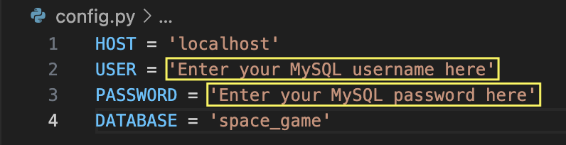

# CFG-project-group-4
**Astro Academy** is a space-themed educational game built with Pygame. The game demonstrates the skills learned during the CFG Degree program. Users control an astronaut navigating through space, avoiding asteroids while learning space-related facts.


## Description

This project is a space-themed game aimed at 7-10 year olds. The game features an astronaut flying through 'space', players need to control the astronaut to avoid oncoming asteroids. Players lose a life if they crash into an asteroid. The lives start at 3 and the game is over when the player has no lives left.
Space-related facts appear periodically throughout the game.
The top high-score is shown at the top of the screen and if the player beats this score, the score is updated for the next game.


**Technologies Used:**
- **Pygame**: The game is built using Pygame for rendering and game mechanics.
- **MySQL**: Space facts are stored in a database, and the game includes a high score tracking system.

### Features:
- **Lives System**: Start with 3 lives. If the player collides with an asteroid they lose one life.
- **High Score**: The top score is displayed at the top of the screen and on the game over screen and updated if the player beats it.
- **Space Facts**: Educational facts about space appear periodically during gameplay.

The game is organized into separate classes for key components:
- **Settings**: Stores screensize settings, fonts, sounds and background scrolling function
- **Astronaut**: Controls the player character.
- **Asteroids**: Handles asteroid spawning and collision detection.
- **Health bar**: Visual representation of the lives left
- **Facts**: Loads and renders facts
- **Timer**: Tracks game time 
  

## Potential Future Features
- **Leaderboard**: A Game Over screen will display the top 10 high scores, with the player's name.
- **Level Progression**: Add new levels or increase the game speed as the player progresses to enhance difficulty.
- **Asteroid Variety**: Introduce different types of asteroids to make the game visually more engaging.
- **Time-based Scoring**: Convert gameplay time into score for added challenge.

## How to Install and Run the Project

To run the game, ensure you have the following dependencies installed:

1. Install Pygame and MySQL connector using `pip`:
   ```bash
   pip install pygame mysql-connector

2. Enter your credentials for SQL in the config file in the settings folder:
   

3. Create the MySQL database via the 'facts_DB.sql' file:
   


# How to Use the Project
1. When the game starts, players are prompted to enter their name.
2. After entering the name, press Enter to start the game.
3. Use the arrow keys to move the astronaut up, down, left and right to avoid the asteroids.
4. If the player collides with an asteroid, they lose a life
5. The game ends when all three lives are lost
6. When all lives are lost there is a 'game over' screen with your high score, to play again press Enter
7. To exit the game press the red 'x' in the top left-hand corner of the screen


# Credits
* Charli Nemeshanyi
* Ellen Parsonage
* Faizah Chowdhury
* Marissa Lamarra
* Molly Brabiner
* Phoebe Crandon 
* Sophie Pope
